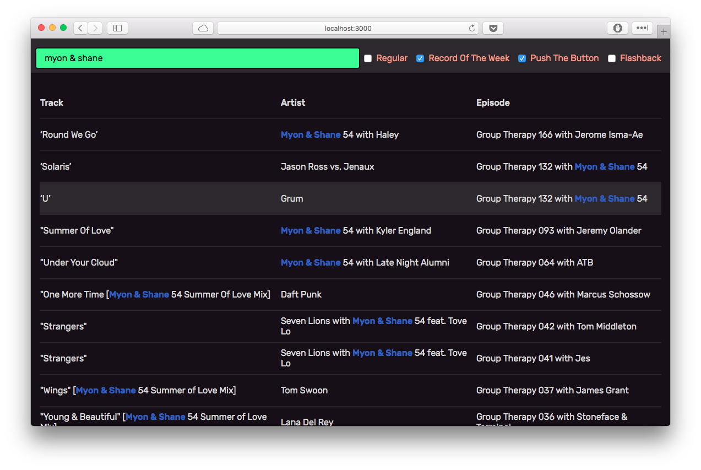

# ABGT Track Search

Simple app to search through 5,000+ tracks from [Above & Beyond Group Therapy](http://www.aboveandbeyond.nu/abgt). Built while learning React.



## Run

Install all dependencies from `bower.json` and `package.json`, and fire up [Grunt](http://gruntjs.com).

```shell
$ grunt
```

## Data

All the track data is stored in `tracks.json`, and was collected using an undocumented API on the Above & Beyond website. To update and format newer data, run `api.py` and `processing.py`.

```shell
$ python api.py
$ python processing.py
```

## License

Released under the MIT license. See LICENSE for details.